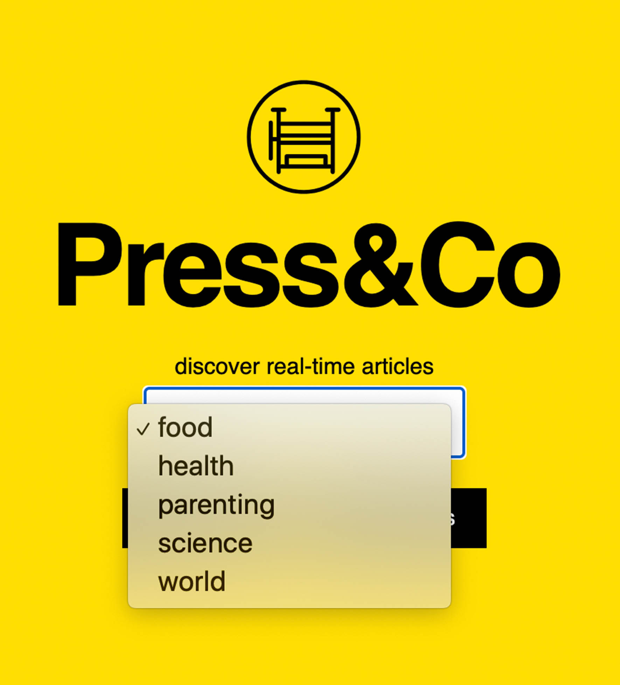
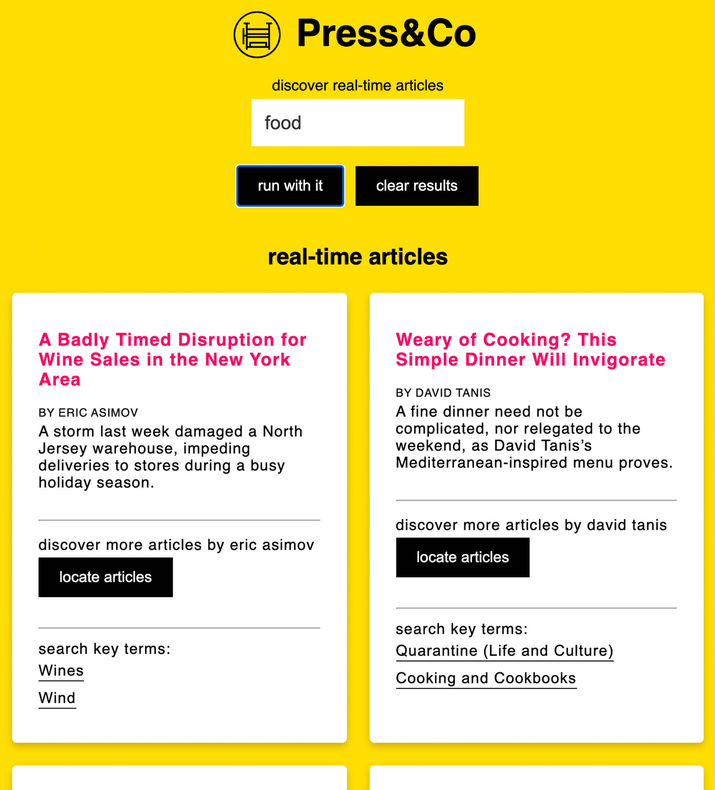
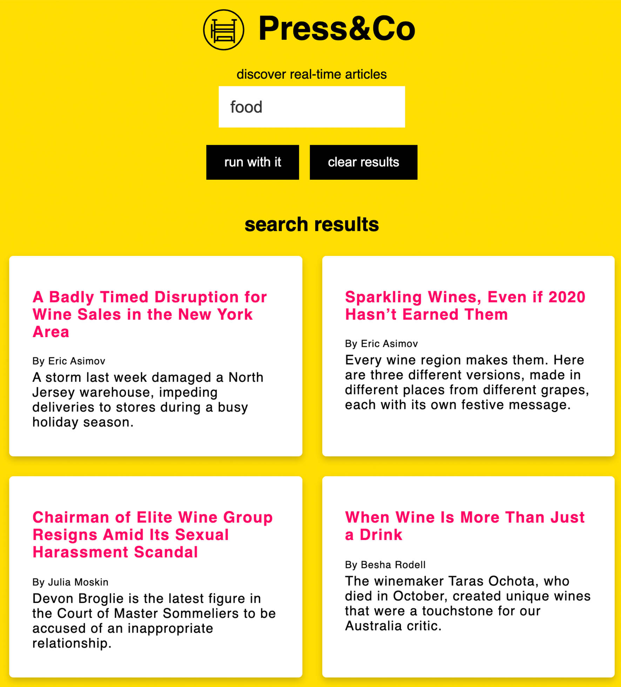

# Press&Co
Discover real-time articles.


# Live Site
```files
https://jpgraziani.github.io/pressAndCo/
```

# GitHub
```github
https://github.com/jpgraziani/pressAndCo
```

# ScreenShots
welcome screen:


Pick a Section:


Filter your sections further by:
* author 
* key words



Further in-depth search:


# Summary
This App will help users access real-time news articles, and based on specific filters; the user can perform a more specific broad search. The user can first select which overarching section they would like to start with. Next, they can view articles or create a more in-depth broad search by click on more articles from the author or keywords. 

# Built With
* HTML5
* CSS3
* JavaScript
* jQuery
* API